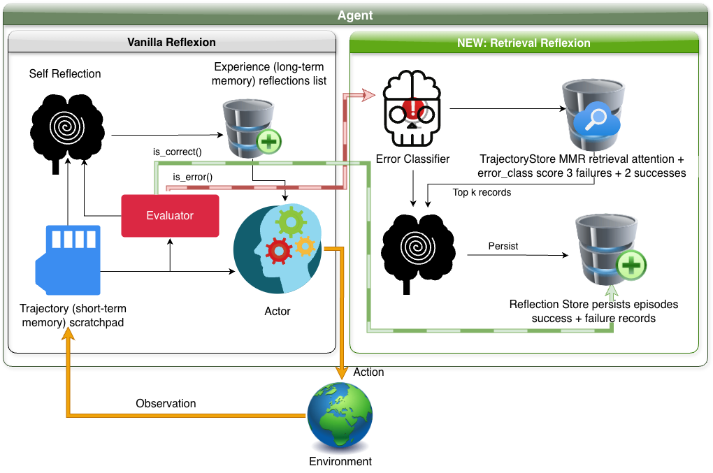

# Retrieval-Augmented Reflexion: Retrieval-Aided Language Agents with Verbal Reinforcement Learning



## Overview

We extend the Reflexion framework with **Retrieval-Augmented Reflexion (RAR)**, a novel strategy that retrieves semantically similar past trajectories from a persistent episodic memory store, diversifies them via Maximum Marginal Relevance (MMR), and uses them as contrastive context when generating reflections. This allows the agent to learn from a broader set of past experiences — both failures and successes — rather than relying solely on the most recent attempt.

We implement and evaluate five strategies across three tasks:

| Strategy       | Description                                                                                                                                     |
| -------------- | ----------------------------------------------------------------------------------------------------------------------------------------------- |
| **Simple**     | Single generation attempt, no reflection or memory (HumanEval only)                                                                             |
| **ReAct**      | No memory, no reflection. Agent attempts each task from scratch every trial                                                                     |
| **CoT + GT**   | Chain-of-thought with ground truth context injected (Wikipedia passage or docstring)                                                            |
| **Reflexion**  | Standard Reflexion with last 3 reflections stored in memory                                                                                     |
| **ExpeL**      | Two-phase: gather trajectories via Reflexion, extract insights, evaluate with injected insights                                                 |
| **RAR (ours)** | Retrieves top-k past trajectories via semantic similarity and error-class matching, diversified via MMR, used as contrastive reflection context |

---

## Setup

### Prerequisites

- Python 3.9+
- An OpenAI-compatible API key

### Environment variable

```bash
export OPENAI_API_KEY=<your key>
```

---

## HotPotQA (Reasoning)

Each experiment runs 100 randomly sampled questions from the HotPotQA distractor dataset across 5 trials.

```bash
git clone https://github.com/USD-AI-ResearchLab/reflexion.git
cd hotpotqa_runs
pip install -r requirements.txt
cd experiments
```

### Run scripts

```bash
python ReactQA.py          # ReAct baseline
python CoTQA.py            # CoT + Ground Truth
python ReflexionQA.py      # Standard Reflexion
python RetrievalQA.py      # RAR (ours)
python ExpelQA.py         # ExpeL baseline
```

Results are saved to `../root/<strategy>/`.

---

## ALFWorld (Sequential Decision-Making)

Each experiment runs 134 household environments across 10 trials.

```bash
cd alfworld_runs
pip install -r requirements.txt
```

### Run scripts

```bash
python main.py --strategy base               --num_trials 10 --num_envs 134 --run_name react_run      --model gpt-oss
python main.py --strategy reflexion          --num_trials 10 --num_envs 134 --run_name reflexion_run  --model gpt-oss --use_memory
python main.py --strategy retrieved_trajectory_reflexion \
               --num_trials 10 --num_envs 134 --run_name rar_run --model gpt-oss --use_memory
python main.py --strategy expel --expel_n_gather 10 \
               --num_trials 11 --num_envs 134 --run_name expel_run --model gpt-oss
```

Results are saved to `./root/<run_name>/`.

---

## HumanEval Hard (Code Generation)

Each experiment runs 50 curated HumanEval Hard problems across 10 iterations.

```bash
cd programming_runs
pip install -r requirements.txt
```

### Run scripts

```bash
python main.py --strategy simple     --run_name simple    --root_dir root \
               --dataset_path ./benchmarks/humaneval-py_hardest50.jsonl \
               --language py --model gpt-oss --max_iters 10 --pass_at_k 1

python main.py --strategy cot_gt     --run_name cot_gt    --root_dir root \
               --dataset_path ./benchmarks/humaneval-py_hardest50.jsonl \
               --language py --model gpt-oss --max_iters 10 --pass_at_k 1

python main.py --strategy reflexion  --run_name reflexion --root_dir root \
               --dataset_path ./benchmarks/humaneval-py_hardest50.jsonl \
               --language py --model gpt-oss --max_iters 10 --pass_at_k 1

python main.py --strategy retrieval  --run_name retrieval --root_dir root \
               --dataset_path ./benchmarks/humaneval-py_hardest50.jsonl \
               --language py --model gpt-oss --max_iters 10 --pass_at_k 1

python main.py --strategy expel      --run_name expel     --root_dir root \
               --dataset_path ./benchmarks/humaneval-py_hardest50.jsonl \
               --language py --model gpt-oss --max_iters 10 --pass_at_k 1
```

Results are saved to `root/<run_name>/`.

---

## Running on Kubernetes (NRP Nautilus)

All experiments can be submitted as Kubernetes batch jobs using the YAML files.

### Before submitting any job

Open the YAML file and update the following fields:

```yaml
metadata:
  namespace: <your-namespace> # e.g. kc-ai-research-lab — MUST match your Nautilus namespace
...
env:
  - name: OPENAI_API_KEY
    valueFrom:
      secretKeyRef:
        name: <your-secret-name> # e.g. openai-secret — must exist in your namespace
        key: api-key # must match the key name inside your secret
...
volumes:
  - name: results-volume
    persistentVolumeClaim:
      claimName: <your-pvc-name> # e.g. reflexion-data-pvc — must exist in your namespace
```

To create the API key secret if it does not already exist:

```bash
kubectl create secret generic openai-secret \
  --from-literal=api-key=<your-api-key> \
  -n <your-namespace>
```

### Submit a job

```bash
kubectl apply -f k8s/<job-file>.yaml -n <your-namespace>
```

### Monitor job status

```bash
kubectl get jobs -n <your-namespace>
kubectl logs job/<job-name> -n <your-namespace>
```

### Copy results from PVC

```bash
kubectl run pvc-reader --image=busybox --restart=Never \
  --overrides='{"spec":{"volumes":[{"name":"data","persistentVolumeClaim":{"claimName":"<your-pvc-name>"}}],"containers":[{"name":"pvc-reader","image":"busybox","command":["sleep","3600"],"volumeMounts":[{"mountPath":"/data","name":"data"}]}]}}' \
  -n <your-namespace>

kubectl cp <your-namespace>/pvc-reader:/data ./results
kubectl delete pod pvc-reader -n <your-namespace>
```

### Available job files

| File                          | Task           | Strategy  |
| ----------------------------- | -------------- | --------- |
| `hotpot_react_job.yaml`       | HotPotQA       | ReAct     |
| `hotpot_reflexion_job.yaml`   | HotPotQA       | Reflexion |
| `hotpot_retrieval_job.yaml`   | HotPotQA       | RAR       |
| `hotpot_expel_job.yaml`       | HotPotQA       | ExpeL     |
| `alfworld_react_job.yaml`     | ALFWorld       | ReAct     |
| `alfworld_reflexion_job.yaml` | ALFWorld       | Reflexion |
| `alfworld_retrieval_job.yaml` | ALFWorld       | RAR       |
| `alfworld_expel_job.yaml`     | ALFWorld       | ExpeL     |
| `prog_simple_job.yaml`        | HumanEval Hard | Simple    |
| `prog_reflexion_job.yaml`     | HumanEval Hard | Reflexion |
| `prog_retrieval_job.yaml`     | HumanEval Hard | RAR       |
| `prog_expel_job.yaml`         | HumanEval Hard | ExpeL     |

---

## Metrics

All experiments report four metrics at each trial or iteration:

| Metric           | Description                                                 |
| ---------------- | ----------------------------------------------------------- |
| **Success Rate** | Cumulative fraction of tasks solved at or before trial $t$  |
| **Fail Rate**    | Fraction of tasks attempted and failed at trial $t$         |
| **Halt Rate**    | Fraction of tasks where the agent exhausted its step budget |
| **Avg Steps**    | Mean number of environment interactions per active task     |

Results CSVs follow the format: `Trial,SuccessRate,FailRate,HaltedRate,AvgSteps`.

---

<!-- ## Citation

If you use this code, please cite the original Reflexion paper and this work:

```bibtex
@inproceedings{shinn2023reflexion,
  title     = {Reflexion: Language Agents with Verbal Reinforcement Learning},
  author    = {Shinn, Noah and Cassano, Federico and Berman, Edward and Gopinath, Ashwin and Narasimhan, Karthik and Yao, Shunyu},
  booktitle = {Advances in Neural Information Processing Systems (NeurIPS)},
  year      = {2023}
}
``` -->
