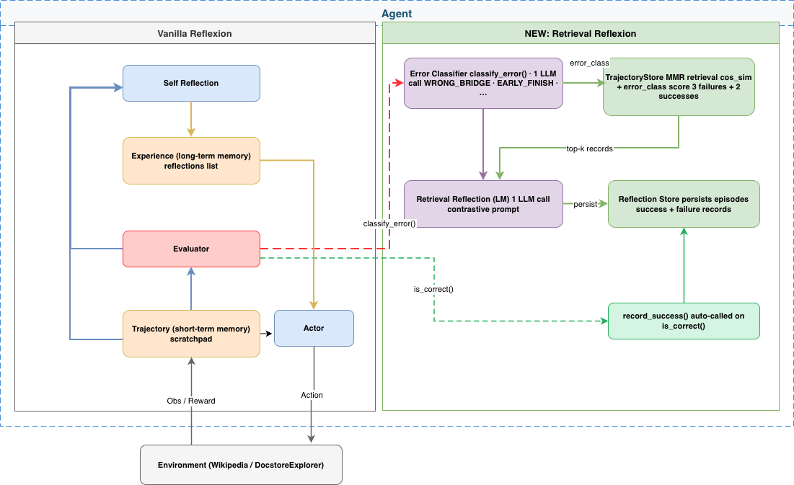

# Retrieval Reflexion: Retrieval Aided Language Agents with Verbal Reinforcement Learning



## To Run: reasoning (HotPotQA)

We have provided a set of scripts to easily run, explore, and interact with the results of the reasoning experiments. Each experiment consists of a random sample of 100 questions from the HotPotQA distractor dataset. Each question in the sample is attempted by an agent with a specific type and reflexion strategy.

We extend the original Reflexion framework with a novel **Retrieval-Augmented Reflexion** strategy. Instead of relying solely on the most recent failed trajectory, our method retrieves the top-k semantically similar past trajectories from an episodic memory store, diversified via Maximum Marginal Relevance (MMR), and uses them as contrastive context when generating reflections. This allows the agent to learn from a broader set of past experiences — both failures and successes — rather than just the immediate previous attempt.

We implement and evaluate four strategies across three tasks (HotPotQA, ALFWorld, Programming(HumanEval)):

- **ReAct (base):** No memory, no reflection. Agent attempts each task from scratch every trial.
- **Reflexion:** Standard reflexion with the last 3 reflections stored in memory.
- **CoT + Context:** Chain-of-thought reasoning with ground truth context injected as structured input (HotPotQA: Wikipedia passage, Programming: docstring).
- **Retrieval-Augmented Reflexion (ours):** Retrieves top-k similar past trajectories using semantic similarity and error class matching, diversified via MMR, and uses them to generate richer, contrastive reflections.

Three experiment files are provided for HotPotQA, corresponding to different strategies:

- `hotpotqa_runs/experiments/cot_context.py` — CoT + Context
- `hotpotqa_runs/experiments/ReactQA.py` — ReAct baseline
- `hotpotqa_runs/experiments/ReflexionQA.py` — Standard Reflexion
- `hotpotqa_runs/experiments/RetrievalQA.py` — Retrieval-Augmented Reflexion (ours)

### Setup

To get started:

1. Clone this repo and move to the HotPotQA directory:

```bash
git clone https://github.com/USD-AI-ResearchLab/reflexion.git && cd ./hotpotqa_runs
```

2. Install the module dependencies into your environment:

```bash
pip install -r requirements.txt
```

3. Set `OPENAI_API_KEY` environment variable to your OpenAI API key:

```bash
export OPENAI_API_KEY=<your key>
```

#### Agent Types

Agent type is determined by the experiment you choose to run. The available agent types include:

- `ReAct` - ReAct Agent

- `CoT_context` - CoT Agent given supporting context about the question

- `Reflexion` - Reflexion using last attempt and reflexion
- `Retrieval Reflexion` - Retrieval augmented reflexion

The scripts for each agent type is located in the `./hotpot_runs/experiments` directory.

#### Reflexion Strategies

Each script allows you to specify the reflexion strategy to be used by the agents. The available reflexion strategies, which are defined in a `ReflexionStrategy` `Enum`, include:

- `ReflexionStrategy.NONE` - The agent is not given any information about its last attempt. Used as the ReAct baseline as well as CoT with added context.

- `ReflexionStrategy.LAST_ATTEMPT_AND_REFLEXION` - The agent is given both its reasoning trace and self-reflection on the last attempt as context. Used as reflexion baseline.

- `ReflexionStrategy.RETRIEVED_TRAJECTORY_REFLEXION` _(ours)_ - The agent retrieves the top-k most similar past trajectories from an episodic memory store, scored by semantic similarity and error class match, diversified via Maximum Marginal Relevance (MMR). These trajectories — both past failures and successes — are used as contrastive context when generating the reflection for the current failed attempt, enabling richer and more targeted self-improvement across trials.

### To Run: decision-making (AlfWorld)

Clone this repo and move to the AlfWorld directory

```bash
git clone https://github.com/USD-AI-ResearchLab/reflexion.git && cd ./alfworld_runs
```

Specify the run parameters in `./run_reflexion.sh`.
`num_trials`: number of iterative learning steps
`num_envs`: number of task-environment pairs per trial
`run_name`: the name for this run
`use_memory`: use persisting memory to store self-reflections (turn off to run a baseline run)
`is_resume`: use logging directory to resume a previous run
`resume_dir`: the logging directory from which to resume the previous run
`start_trial_num`: if resume run, then the trial number of which to start

Run the trial (Example for retrieval reflexion trial)

```bash
./prog_retrieval_reflexion.sh
```

The logs will be sent to `./root/<run_name>`.

## Programming Task (HumanEval)

We evaluate four strategies on the [HumanEval](https://github.com/openai/human-eval) Python programming benchmark consisting of 164 function generation problems. Each problem provides a function signature and docstring, and the agent must generate a correct implementation that passes all unit tests.

### Setup

```bash
cd programming_runs
pip install -r requirements.txt
```

### Download the dataset

The HumanEval dataset is already provided in the `benchmarks/` directory:

```
benchmarks/
  humaneval-py.jsonl
```

### Running the experiments

Four strategies are available, each with a corresponding shell script:

**Experiment 1: Simple Generation (baseline)**

```bash
./prog_simple_generation.sh
```

**Experiment 2: CoT + Ground Truth Context**

```bash
./prog_cot_gt.sh
```

**Experiment 3: Standard Reflexion**

```bash
./prog_reflexion.sh
```

**Experiment 4: Retrieval-Augmented Reflexion (ours)**

```bash
./prog_retrieval_reflexion.sh
```

### Strategy details

- **Simple:** Single generation attempt per problem, no reflection or memory.
- **CoT + GT:** Chain-of-thought reasoning with the function docstring injected as structured ground truth context before generation. Tests whether explicit specification guidance improves code generation.
- **Reflexion:** Iterative self-improvement — the agent generates code, runs internal unit tests, reflects on failures, and retries up to `max_iters` times.
- **Retrieval-Augmented Reflexion (ours):** Extends Reflexion by retrieving the top-k most similar past problems from an episodic trajectory store, scored by function signature similarity and error class match, diversified via MMR. Retrieved trajectories provide contrastive context (both failures and successes) when generating reflections, enabling cross-problem learning.

### Metrics and results

Results are saved to `root/<run_name>/` and include:

### Configuration

Key arguments for `main.py`:

| Argument         | Description                                                   | Default  |
| ---------------- | ------------------------------------------------------------- | -------- |
| `--strategy`     | One of `simple`, `cot_gt`, `reflexion`, `retrieval_reflexion` | required |
| `--max_iters`    | Max self-improvement iterations per problem                   | 10       |
| `--pass_at_k`    | Number of generation attempts per problem                     | 1        |
| `--num_problems` | Number of problems to run (-1 for full dataset)               | -1       |
| `--model`        | Model name                                                    | required |
| `--language`     | `py` or `rs`                                                  | required |
